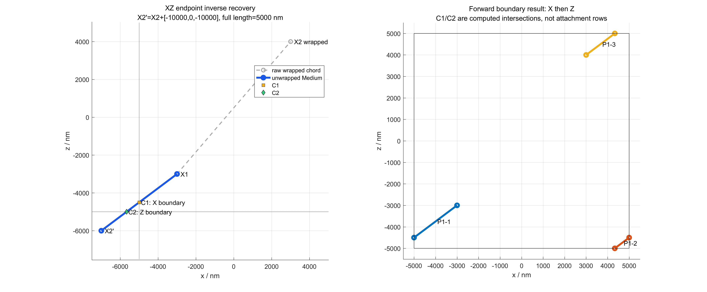
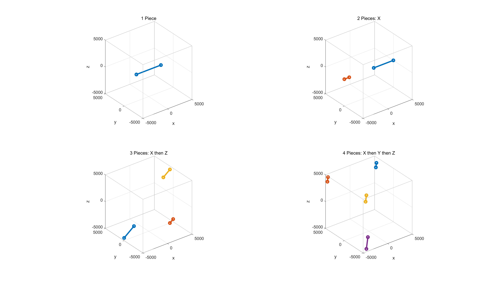
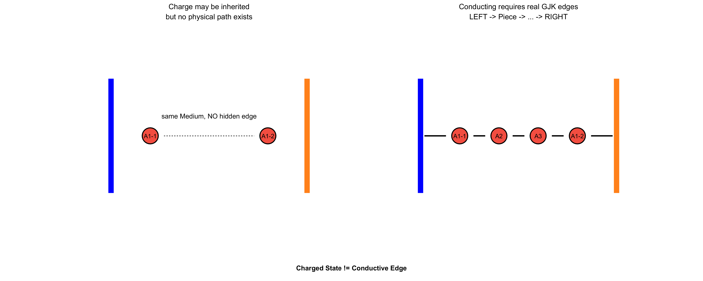
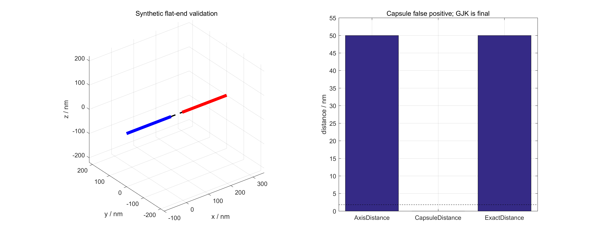
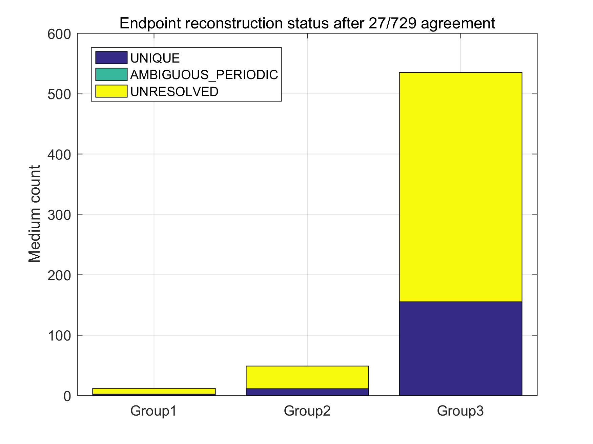

# 2026华数杯A题：微构体中填充导电介质的仿真优化

本仓库是 A 题 Q1 的 MATLAB R2016a 独立验证工程。题目研究边长 10000 nm 的微构体中，有限平端圆柱介质 A 能否在左右带电表面之间形成真实导电通路。介质 A 的轴长为 5000 nm、半径为 30 nm，介质或电极间表面距离不超过 1.8 nm 时才视为导通。题目原文见 [A_problem.pdf](docs/A_problem.pdf)。

## Q1：端点逆向周期恢复模型专项验证

本分支 `q1-endpoint-unfold-final` 严格验证一个且仅一个数据模型：

```text
一行 Excel = 一根独立介质 Ai
六个数 = 该介质轴线的两个端点 X1、X2
```

本分支不跨 Excel 行配对，不合并方向族，不把一行当作边界截断后的 GeometryPiece，也不根据其它记录补出当前介质。实验目标是判断：附件每行的两个坐标能否通过三轴周期逆平移恢复为一根完整的 5000 nm 介质。

正式入口为：

```matlab
setup_project
run('scripts/run_q1_endpoint_rebuild.m')
```

全部新输出位于 `output/Q1_endpoint_rebuild/`，不会覆盖事故版本的 `output/Q1/`。

## 附件数据定义与 schema

PDF 的附件说明明确指出：每个分表表示一个微构体，每行表示一个介质 A；前三列是一个轴端顶点，后三列是另一个轴端顶点。MATLAB 实际读取并确认：

| Sheet | 两级表头 | P1 | P2 | Records |
|---|---|---|---|---:|
| 组1 | 顶点1/顶点2；X Y Z X Y Z | columns 1–3 | columns 4–6 | 12 |
| 组2 | 顶点1/顶点2；X Y Z X Y Z | columns 1–3 | columns 4–6 | 49 |
| 组3 | 顶点1/顶点2；X Y Z X Y Z | columns 1–3 | columns 4–6 | 535 |

完整 sheet、header、坐标列和每组前五条记录见 [`excel_schema_audit.txt`](output/Q1_endpoint_rebuild/logs/excel_schema_audit.txt)。schema 不明确时脚本会停止，不会进入 Endpoint 枚举。

## 周期端点逆向恢复

设附件中的两个坐标为 `X1w,X2w`，盒长 `B=10000 nm`。两个端点在无限展开空间中的周期像可写成

```text
X1u = X1w + B*n1
X2u = X2w + B*n2
```

因此

```text
Delta_w = X2w - X1w
X2u - X1u = Delta_w + B*(n2-n1)
```

令 `k=n2-n1`，正式算法枚举

```text
k = [kx,ky,kz] in {-1,0,1}^3
Delta(k) = Delta_w + 10000*k
abs(norm(Delta(k))-5000) <= endpointLengthTolerance
```

默认 `endpointLengthTolerance=1e-3 nm`。所有 27 个 `k` 都会检查，即使表内两点直接距离已经是 5000 nm 也不会提前返回。X/Y/Z 可以同时非零，所有合法候选均保留，不偏好 `k=0`、最小平移或第一个候选。

正式代码把 `UnwrappedStart` 固定为 `X1w`，只构造 `UnwrappedEnd=X1w+Delta(k)`，这并不表示物理上只允许 X2 平移。整根介质共同平移任意 `10000*[nx,ny,nz]` 不改变盒内几何；固定一个周期代表只是消除了共同平移自由度。

## 729 双端点枚举交叉验证

为直接排除“X1 也可能被平移”和“两个端点可沿多个轴分别平移”的疑问，验证器 [`enumerateEndpointImagePairs.m`](src/enumerateEndpointImagePairs.m) 显式枚举：

```text
n1 in {-1,0,1}^3
n2 in {-1,0,1}^3
27 * 27 = 729 endpoint image pairs
```

729 法保留每个 `X1candidate`、`X2candidate`、长度、误差、`n1/n2` 和相对 `k`。经过共同周期平移与盒内物理几何去重后，它必须与 [`unwrapMediumEndpoints.m`](src/unwrapMediumEndpoints.m) 的 27 法给出完全相同的候选集合。

本次实际结果为：

```text
Relative-27 vs Explicit-729 consistency = 596 / 596 PASS
```

这既验证了数学降维，也验证了代码没有漏掉 X1、X2 分别平移或 XYZ 多轴同时平移的情况。

## 完整介质的 Forward Boundary Wrap

只有先恢复出完整 5000 nm 轴段后，才调用 `wrapSegmentToBox`。轴线参数式为

```text
P(t) = P0 + t(P1-P0), 0 <= t <= 1
```

程序计算它与所有周期平面 `x/y/z=5000+n*10000` 的交点参数，排序并合并相同 `t`，再以区间中点确定每段所属周期 cell，将整个区间平移回 `[-5000,5000]^3`。同一时刻穿越 XY 或 XYZ 只产生一个断点，不产生零长度 Piece。

下图使用 `k=[-1,0,-1]`：`X2'=X2+[-10000,0,-10000]` 恢复完整 5000 nm 介质，随后由算法计算 X 边界交点 C1 和 Z 边界交点 C2，自动产生 P1-1、P1-2、P1-3。C1/C2 不是附件输入，也不来自其它 Excel 行。



1/2/3/4 Piece、X→Z、X→Y→Z、同时 XY 和同时 XYZ 均有单元测试。



## 候选物理去重与状态

每个长度候选都必须正向 wrap，并验证：

- 所有 Piece 坐标位于盒内；
- 每个 Piece 长度为正；
- Piece 总长度为 5000 nm；
- 候选首尾与附件端点周期等价。

[`canonicalizeWrappedGeometry.m`](src/canonicalizeWrappedGeometry.m) 对每个 Piece 消除端点方向，并对 Piece 集合排序。不同 `n1/n2` 或 `k` 若得到同一盒内 Piece 集合，只算一个物理解。最终状态只有：

- `UNRESOLVED`：0 个物理解；
- `UNIQUE`：1 个物理解；
- `AMBIGUOUS_PERIODIC`：多个不同盒内物理解，全部保留且不强选。

## Medium、GeometryPiece、Charged 与 Connected

一根完整 Medium 经正向边界处理可形成多个 `Ai-j` GeometryPiece。它们共享 `MediumID`，但 Piece 是物理图节点。

同一 Medium 的 Piece 可以继承带电状态；这种继承不会调用 `addEdge`，也不会让两个空间分离的 Piece 自动连通：

```text
same MediumID => may share Charged State
same MediumID != Conductive Edge
Charged != Connected
```



只有 `x=-5000` 的 LEFT 和 `x=5000` 的 RIGHT 是电极。Y/Z 四面参与周期边界处理，但不能产生 Direct Charge。

## 有限圆柱距离与 Piece-level 图

不同 Piece 之间先计算有限轴线段距离；若 `d_axis>2*30+1.8=61.8 nm` 直接排除，否则用 GJK 计算两个有限平端实心圆柱的真实距离。只有 `d_exact<=1.8 nm` 才建立物理边。

`axisDistance-60` 是 capsule 近似，不能作为最终判据。下图的合成平端案例中，capsule 会误判，而 GJK 给出真实端面间距。



不同 Medium 只在最终盒内 GeometryPiece 间计算欧氏距离，禁止 minimum-image 或复制全局周期镜像。最终导通必须由 BFS 找到完全由真实边组成的路径：

```text
LEFT -> Piece -> Piece -> ... -> RIGHT
```

## MATLAB 测试结果

MATLAB `9.0.0.341360 (R2016a)` 实际运行通过了：

- Excel schema；
- 27 与 729 人工一致性；
- 无平移、仅 X1、仅 X2、X1-X/X2-Z、X2 同时 XZ、XYZ；
- 多个数学表达物理去重、真实周期多解保留、无解继续、端点反转不变；
- 1/2/3/4 Piece、X→Z、X→Y→Z、同时 XY、同时 XYZ；
- segment distance、有限圆柱 GJK；
- same Medium 无隐藏导电边、Charge inheritance、Y/Z 绝缘；
- 真实 Piece 桥接、断桥仍不导通、禁止全局周期假边。

完整测试日志见 [`q1_endpoint_test_results.txt`](output/Q1_endpoint_rebuild/logs/q1_endpoint_test_results.txt)，静态检查结果为 `TOTAL_ISSUES=0`，见 [`checkcode.log`](output/Q1_endpoint_rebuild/logs/checkcode.log)。

## 附件 596 条实际验证结果

| Group | Records | Raw5000 | Unique | Ambiguous | Unresolved |
|---|---:|---:|---:|---:|---:|
| 1 | 12 | 2 | 2 | 0 | 10 |
| 2 | 49 | 11 | 11 | 0 | 38 |
| 3 | 535 | 155 | 155 | 0 | 380 |
| 合计 | 596 | 168 | 168 | 0 | 428 |



本次附件中所有唯一候选都是原始 `k=[0,0,0]` 轴段；没有附件记录通过非零相对移位恢复为 5000 nm。

| Shift Type（UNIQUE 候选） | Count |
|---|---:|
| No Shift | 168 |
| Single-axis | 0 |
| Two-axis | 0 |
| Three-axis | 0 |

| Group | 1 Piece | 2 Piece | 3 Piece | 4 Piece |
|---|---:|---:|---:|---:|
| 1 | 2 | 0 | 0 | 0 |
| 2 | 11 | 0 | 0 | 0 |
| 3 | 155 | 0 | 0 | 0 |

上述 Piece 表只描述 168 个 `UNIQUE` 端点记录，不代表完整微构体。人工测试已经验证非零多轴恢复可正确产生 3/4 Piece。

### 容差敏感性

| Tolerance / nm | Group1 U/A/R | Group2 U/A/R | Group3 U/A/R |
|---:|---:|---:|---:|
| `1e-6` | 2/0/10 | 11/0/38 | 155/0/380 |
| `1e-4` | 2/0/10 | 11/0/38 | 155/0/380 |
| `1e-3` | 2/0/10 | 11/0/38 | 155/0/380 |
| `1e-2` | 2/0/10 | 11/0/38 | 155/0/380 |

四档结果完全相同；428 个无解不是默认容差造成的。

## 当前 Q1 结论

```text
ENDPOINT_MODEL_COMPLETE = false
```

27 法与 729 法对全部数据完全一致，说明无解并非漏掉 X1、X2 分别平移或 XYZ 组合。冲突发生在数据模型本身：在“一行两个坐标是同一根完整 5000 nm 介质的两个轴端点”这一限定下，428 行的 27 个相对周期位移均不能满足 5000 nm。

因此本轮实验已经完整处理 596/596 行并成功结束，但不对 Group1/2/3 声称最终 `Conducting` 或 BFS 结果。`UNRESOLVED` 不能被写成 `NON_CONDUCTING`，也不能通过跨行组合或改变端点语义来填补。

全部无解 RecordID 列表见 [`q1_endpoint_summary.txt`](output/Q1_endpoint_rebuild/q1_endpoint_summary.txt)；每条记录最接近 5000 nm 的 `k` 和误差见 [`endpoint_reconstruction_audit.csv`](output/Q1_endpoint_rebuild/tables/endpoint_reconstruction_audit.csv)。本次无 `AMBIGUOUS_PERIODIC` 记录。

## 论文数据与可复核输出

- [`endpoint_pair_diagnostics.csv`](output/Q1_endpoint_rebuild/tables/endpoint_pair_diagnostics.csv)：596×729=434,484 个双端点候选；
- [`endpoint_relative_shift_diagnostics.csv`](output/Q1_endpoint_rebuild/tables/endpoint_relative_shift_diagnostics.csv)：596×27=16,092 个相对位移候选；
- [`endpoint_enumerator_consistency.csv`](output/Q1_endpoint_rebuild/tables/endpoint_enumerator_consistency.csv)：596 行，全部 `Pass=1`；
- [`endpoint_reconstruction_audit.csv`](output/Q1_endpoint_rebuild/tables/endpoint_reconstruction_audit.csv)：596 行正式状态、唯一候选、最近 `k` 与误差；
- [`tolerance_sensitivity.csv`](output/Q1_endpoint_rebuild/tables/tolerance_sensitivity.csv)：四档容差；
- [`reconstructed_pieces.csv`](output/Q1_endpoint_rebuild/tables/reconstructed_pieces.csv)：168 个唯一端点 Medium 的 Piece 明细；
- [`piece_count_audit.csv`](output/Q1_endpoint_rebuild/tables/piece_count_audit.csv)：596 行 Piece 状态；
- [`matlab_q1_endpoint_rebuild.log`](output/Q1_endpoint_rebuild/logs/matlab_q1_endpoint_rebuild.log)：完整 MATLAB 运行日志。

因为 Endpoint Hard Gate 未通过，本次不生成 `physical_edges.csv`、`charge_state_audit.csv`、`q1_final_results.csv` 或 Group1/2/3 final network，避免把唯一子集误报为完整 Q1 结论。
