# 2026华数杯A题——问题1数学模型与仿真结果

## 1. 最终结论

| 微构体 | 最终判定 | 可核验的证明类型 |
|---|---|---|
| Group1 | **不导通** | 将全部未确定介质扩大为乐观几何包络后，上界图仍无 LEFT–RIGHT 路径 |
| Group2 | **导通** | 唯一恢复介质构成的下界图已存在 LEFT–RIGHT 路径 |
| Group3 | **导通** | 唯一恢复介质构成的下界图已存在 LEFT–RIGHT 路径 |

这里的“下界”和“上界”是集合包含意义上的证明工具：下界只使用能够严格恢复的真实有限圆柱，出现贯通路径即可证明导通；上界故意增加 Group1 未确定介质可能产生的接触，若仍不贯通即可证明不导通。最终答案由程序读取 Excel、恢复几何、建立图并执行 BFS 后生成，而不是人工指定。

## 2. 参数与判据

| 符号 | 数值 | 含义 |
|---|---:|---|
| $H$ | $5000\ \mathrm{nm}$ | 立方体半边长，计算域为 $[-H,H]^3$ |
| $L$ | $10000\ \mathrm{nm}$ | 周期长度 |
| $L_A$ | $5000\ \mathrm{nm}$ | A 类导电介质轴长 |
| $R$ | $30\ \mathrm{nm}$ | 有限平端圆柱半径 |
| $d_0$ | $1.8\ \mathrm{nm}$ | 表面导通距离阈值 |
| $2R+d_0$ | $61.8\ \mathrm{nm}$ | 圆柱—圆柱轴线宽相筛选阈值 |
| $R+d_0$ | $31.8\ \mathrm{nm}$ | 圆柱轴线—电极平面的乐观阈值 |
| $\varepsilon_g$ | $10^{-3}\ \mathrm{nm}$ | 几何长度与边界判断容差 |

左右电极分别是 $x=-5000$ 与 $x=5000$ 平面；$y,z$ 的六个周期面只负责几何折返，不是电极。

## 3. 数据含义与建模假设

`data/attachment.xlsx` 的三个工作表分别含 12、49、535 行介质记录。每行的 `P1=[X1,Y1,Z1]` 与 `P2=[X2,Y2,Z2]` 表示**同一根原始介质经过周期边界截断和平移后，在本计算盒内保留的一段 GeometryPiece 的两个端点**。因此：

- 一行就是一个 Medium，不跨 Excel 行拼接原始介质；
- 顶点是观察段的端点，不应默认解释为原始 5000 nm 圆柱的两个端点；
- 正式周期边界只有 $x,y,z=\pm5000\ \mathrm{nm}$；
- 坐标 $\pm500$ 不是边界。全表共有 28 条记录出现 $\pm500$，19 条“短且无正式边界”的记录全部在其中，这只是数据模式诊断，不能把 $\pm500$ 当作裁剪面。

## 4. 原地遗留段的逆向恢复

对观察端点 $P_1,P_2$，定义

$$
L_{\mathrm{obs}}=\lVert P_2-P_1\rVert_2.
$$

若 $|L_{\mathrm{obs}}-5000|\leq\varepsilon_g$，该行是 `DIRECT_FULL`。若 $L_{\mathrm{obs}}<5000$ 且恰有一个端点位于正式边界，记非边界端点为 $I$、边界端点为 $C$，令

$$
\mathbf u=\frac{C-I}{L_{\mathrm{obs}}},\qquad
L_m=5000-L_{\mathrm{obs}},
$$

则原始介质候选为

$$
P_s=I,\qquad P_e=C+L_m\mathbf u.
$$

方向还必须由盒内指向活动边界外侧。短记录若有两个正式边界端点，缺失长度可能分布在两端，记为 `AMBIGUOUS_TWO_BOUNDARY_RETAINED`；若没有正式边界端点，记为 `UNRESOLVED_NO_FORMAL_BOUNDARY`。这两类都不强行选择一个原圆柱。

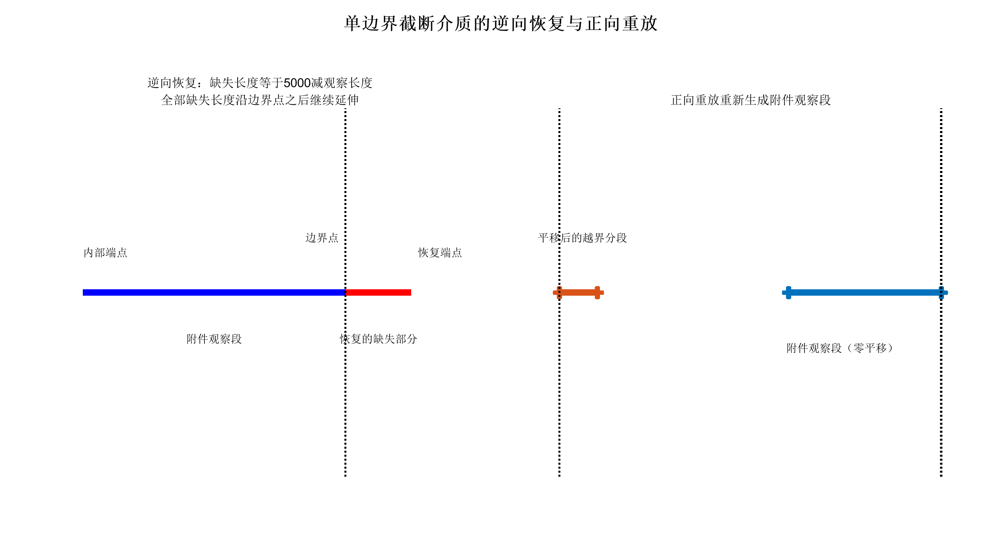

## 5. 周期边界事件与正向重放

恢复后的轴段参数方程为

$$
P(t)=P_s+t(P_e-P_s),\qquad 0\leq t\leq1.
$$

对第 $j\in\{x,y,z\}$ 个坐标及边界符号 $s\in\{-1,+1\}$，候选边界事件参数为

$$
t_{j,s}=\frac{sH-P_{s,j}}{P_{e,j}-P_{s,j}},\qquad 0<t_{j,s}<1.
$$

程序只保留方向一致且最先发生的有限事件；若多轴事件的 $t$ 在容差内相同，则作为同一角点事件处理，避免零长度 Piece。穿越某面后，对剩余轴段施加相应的 $\pm L\mathbf e_j$ 平移，再继续查找下一事件。因此一根 5000 nm 介质可以依次穿越 X、Y、Z 并产生 1–4 个 Piece。

每个唯一候选都必须经 `wrapSegmentToBox` 正向重放，并在生成结果中以 `Translation=[0,0,0]` 找回附件观察段；端点顺序允许反转。重放失败即拒绝候选，不放宽容差。

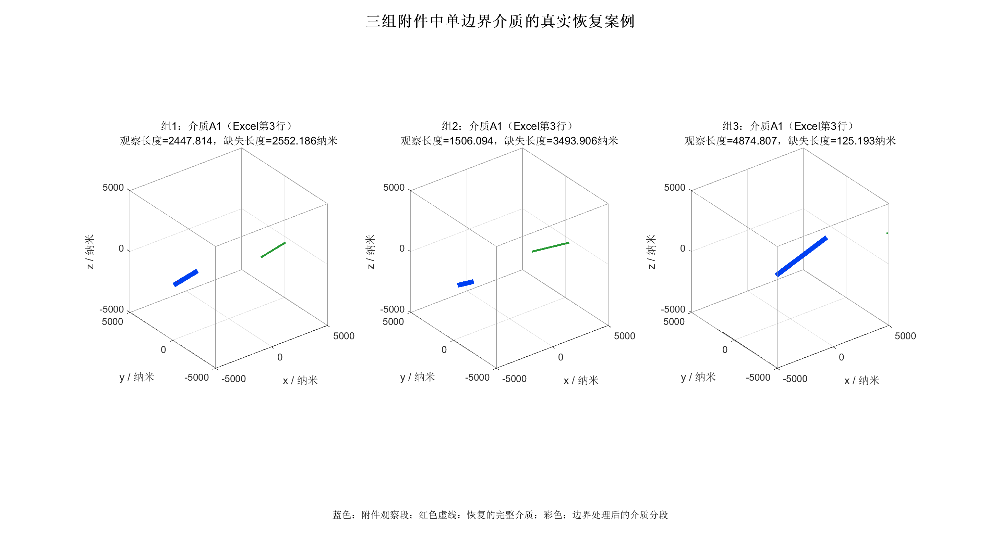

## 6. 恢复一致性统计

| 分类 | 数量 |
|---|---:|
| 原始观察长度已为 5000 nm | 168 |
| 单正式边界短记录 | 379 |
| 通过逆向恢复与正向重放 | 379 |
| 正向重放失败 | 0 |
| 双正式边界、仍不唯一 | 30 |
| 短且无正式边界、无法恢复 | 19 |

`379/379` 表示单边界记录在本模型下通过了**内部逆向—正向一致性检查**，并不等价于证明附件一定由该机制生成。未确定的 49 条记录仍被明确保留，未被伪造为唯一几何。

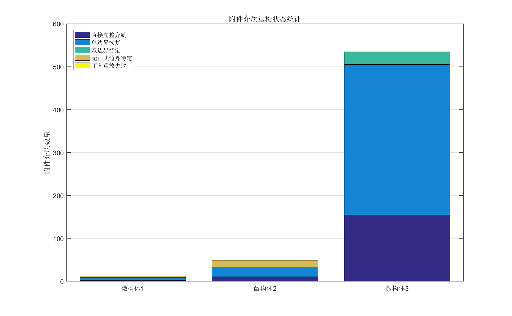

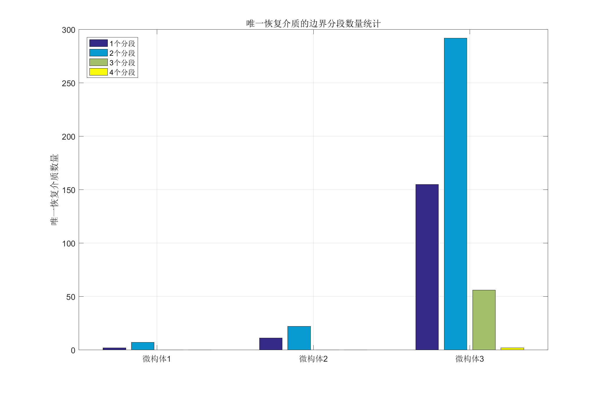

## 7. 有限圆柱距离与接触判定

任意两个不同 Medium 的 GeometryPiece 先计算有限轴段距离 $d_{\mathrm{axis}}$。由胶囊体必要条件，若

$$
d_{\mathrm{axis}}>2R+d_0=61.8\ \mathrm{nm},
$$

则有限圆柱表面不可能达到导通阈值，可直接排除。通过宽相的 pair 再进入 GJK，对**有限长度、带平端的闭圆柱**计算精确欧氏距离

$$
d_{\mathrm{GJK}}(C_i,C_j)
=\min_{x\in C_i,\,y\in C_j}\lVert x-y\rVert_2.
$$

仅当 $d_{\mathrm{GJK}}\leq d_0$ 时建立真实物理边。轴线胶囊距离只用于宽相或上界证明，不替代正式 GJK；同一 Medium 因周期裁剪形成的兄弟 Piece 不建立虚假的自接触边。

## 8. 图模型、带电与导通

正式导电图记为

$$
G=(V,E),\qquad
V=\{\mathrm{LEFT},\mathrm{RIGHT}\}\cup\{\text{GeometryPieces}\}.
$$

$E$ 包含不同 Medium 之间通过 GJK 判据的圆柱接触边，以及 Piece 与左右电极的接触边。某 Piece “带电”只说明它直接接触电极，或与同一原始 Medium 的另一 Piece 共享电位；这不等于已经连通另一电极。最终判据是

$$
\text{Conducting}(G)\iff
\exists\ \text{path in }G:\ \mathrm{LEFT}\leadsto\mathrm{RIGHT}.
$$

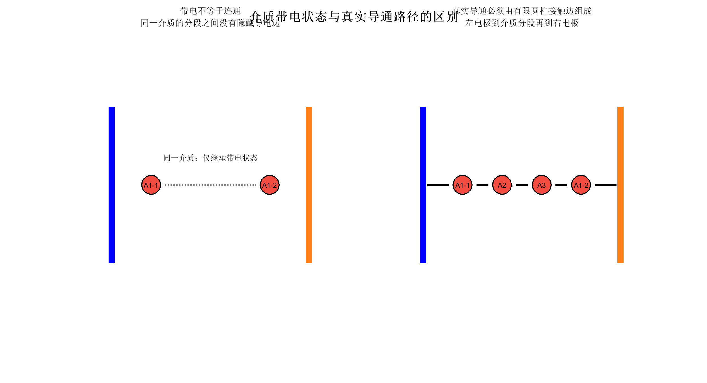

## 9. 下界与上界证明

对唯一恢复的真实介质建立下界图 $G_{\mathrm{lower}}$。它不包含不确定介质可能贡献的边，因而

$$
G_{\mathrm{lower}}\subseteq G_{\mathrm{true}}.
$$

若 $G_{\mathrm{lower}}$ 已有 LEFT–RIGHT 路径，真实图必然导通。这给出 Group2、Group3 的充分证明。

Group1 的未确定记录是 A6、A7、A11。对每条观察轴段令 $M=5000-L_{\mathrm{obs}}$，构造故意扩大的证明包络

$$
E_s=P_1-M\mathbf u,\qquad E_e=P_2+M\mathbf u.
$$

任何满足两端缺失量 $a+b=M$ 的真实 5000 nm 共线圆柱都被该轴包络覆盖。包络经周期折返后，与其他介质之间使用更宽松的 $d_{\mathrm{axis}}\leq61.8$ 建边，与电极使用 $31.8$ nm 阈值；已知—已知边则完整保留正式 GJK 结果。因此

$$
G_{\mathrm{true}}\subseteq G_{\mathrm{upper}}.
$$

程序得到包络—已知轴段最小距离 $107.344730206884$ nm、包络—包络最小距离 $245.656423416521$ nm，均大于 $61.8$ nm，且 $G_{\mathrm{upper}}$ 仍无 LEFT–RIGHT 路径，故 Group1 必不导通。包络只是反证工具，不是对 A6、A7、A11 的强行恢复。

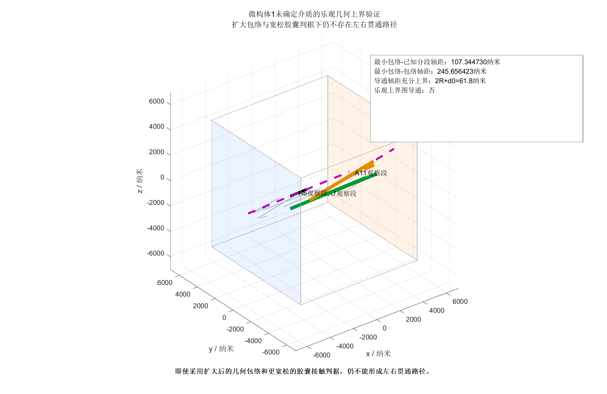

## 10. 三组程序化数值结果

| Group | Medium 数 | 唯一/歧义/未解 | Piece 数 | 物理边 | LEFT 接触 | RIGHT 接触 | 最终结论 |
|---|---:|---:|---:|---:|---:|---:|---|
| 1 | 12 | 9 / 0 / 3 | 16 | 12 | 7 | 7 | 不导通（乐观上界） |
| 2 | 49 | 33 / 0 / 16 | 55 | 60 | 22 | 22 | 导通（下界路径） |
| 3 | 535 | 505 / 30 / 0 | 915 | 659 | 181 | 179 | 导通（下界路径） |

表中的 Piece、物理边和电极接触数属于唯一恢复下界图；Group1 的上界在此基础上另加入 A6、A7、A11 的 5 个包络 Piece，并单独输出审计表。

## 11. 可复核的最短导通路径

Group2 的 BFS 路径为：

```text
LEFT -> A2-1 -> A12-1 -> A24-1 -> A10-2 -> RIGHT
```

Group3 的 BFS 路径为：

```text
LEFT -> A63-1 -> A264-1 -> A216-1 -> A351-1 -> RIGHT
```

路径节点采用 `A<MediumID>-<PieceIndex>` 命名，可由最终 CSV 和三维图逐项核对。Group1 的正式下界与乐观上界均无路径。

## 12. 三维仿真结果

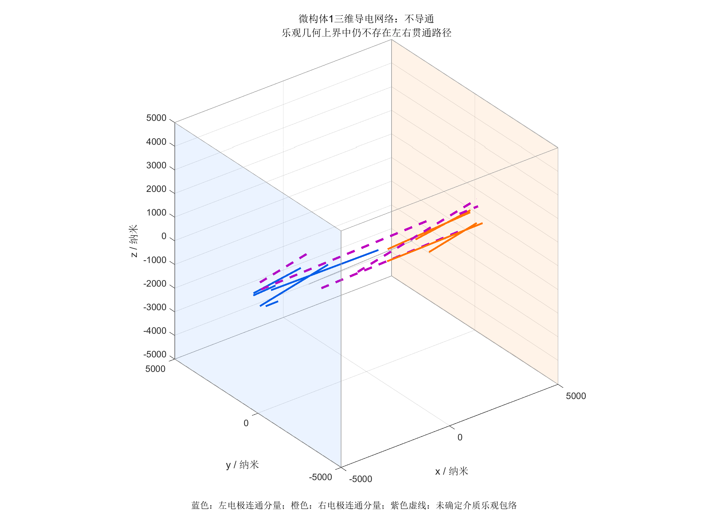

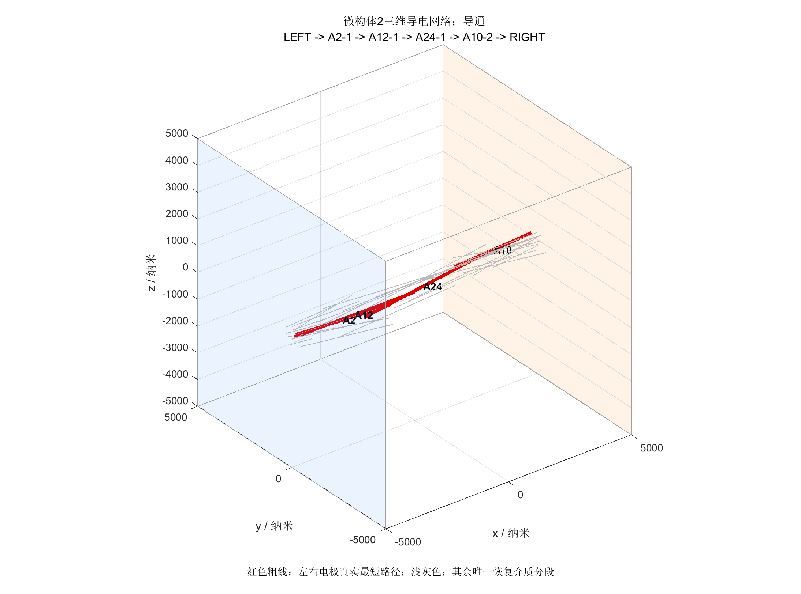

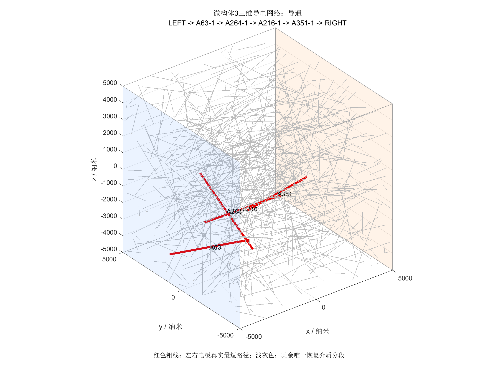

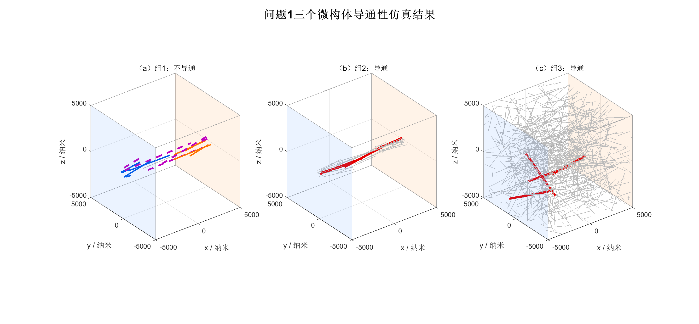

三维图将普通 Piece 合并为 NaN 分隔的批量折线，将最短路径单独加粗，因此 Group3 的 915 个 Piece 也只需常数量级的 line 句柄。左右电极分别用淡蓝和淡橙平面表示。

## 13. 算法步骤

1. 读取三个 Excel 工作表，审计两层表头、坐标列和 596 行记录。
2. 按 $L_{\mathrm{obs}}$ 与正式边界端点数分类，不把 $\pm500$ 当边界。
3. 对 Direct 与单边界记录生成唯一原圆柱候选。
4. 用有限边界事件驱动 `wrapSegmentToBox`，正向重放并核对零平移观察 Piece。
5. 仅收集唯一恢复结果，形成下界 GeometryPiece 集合。
6. 用轴段距离做宽相，用有限圆柱 GJK 做正式 pair 接触判定。
7. 建立电极—Piece—Piece 图，BFS 搜索 LEFT–RIGHT 路径。
8. 若下界导通，输出充分证明；否则为 Group1 未解介质建立乐观包络上界图。
9. 写出状态、审计表、路径和最终结论；出图脚本只加载冻结状态，不重新计算几何或 GJK。

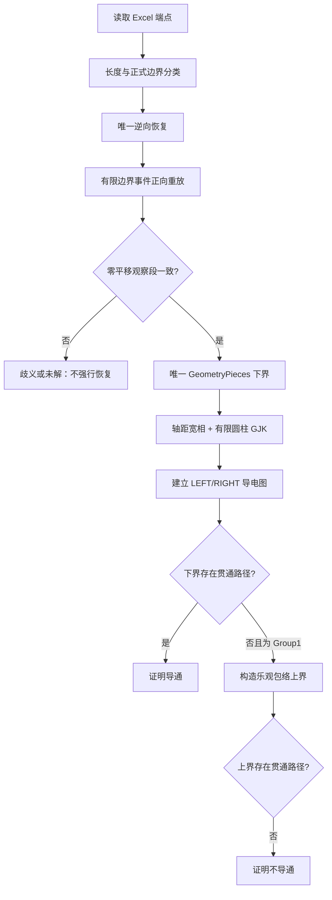

## 14. 单元测试与可靠性

工程在 MATLAB 9.0 R2016a 下完成以下检查：

- 13 个恢复语义案例，包括端点反转、无正式边界、双边界歧义、非法观察位置和同步 XY 事件；
- `wrapSegmentToBox` 的 1、2、3、4 Piece 以及同步 XY/XYZ 无零长度 Piece；
- 5 个轴段距离案例和 5 个有限圆柱 GJK 案例；
- 同 Medium 不误建物理边、跨 Piece 电位继承、真桥/断桥、绝缘 Z 面和无全局周期假边；
- Group1 上界测试：未解 Medium 集合、包络长度、下界边包含关系、无兄弟包络假边、有限证书距离均通过；
- Code Analyzer 对本次新增/修改 MATLAB 文件要求零问题；最终脚本还校验三组答案、10 张 PNG、清单和 README 引用。

## 15. 可复现实验入口与输出

计算与图形已经拆分。任何时刻只运行一个 MATLAB 进程：

```matlab
setup_project
run('scripts/run_q1_paper_compute.m')       % 无图形；保存 -v7 paper_state.mat
run('scripts/run_q1_paper_figures_safe.m')  % 只读 paper_state；不重构、不跑 GJK
run('scripts/run_q1_paper_final.m')         % 最终只读验证
```

Windows 上出图使用 `matlab -softwareopengl`；重图按 Figure ID 6–10 分别启动并等待进程退出。核心输出位于 `output/Q1_paper_final/`：

- `paper_state.mat`：冻结计算状态，MATLAB v7 格式；
- `q1_final_summary.txt`：三组最终结论、证明类型和路径；
- `tables/q1_final_results.csv`：组级最终数值；
- `tables/q1_reconstruction_summary.csv`：恢复分类与 Piece 数；
- `tables/group1_upper_bound_audit.csv`：A6/A7/A11 包络和距离证书；
- `figures/figure_manifest.csv`：10 张 200 dpi 中文 PNG 的逐图状态；
- `logs/`：计算、逐图、测试、Code Analyzer 与最终验收日志。

保留并未修改的核心数学函数包括 `reconstructFromRetainedPart.m`、`wrapSegmentToBox.m`、`segmentSegmentDistance.m`、`gjkCylinderDistance.m`、`buildPieceConductGraph.m` 和 `computeChargeState.m`。

## 16. 附录：Endpoint 周期枚举为何被否证

早期 Endpoint 假设把附件两个端点分别加上周期向量。完整枚举为

$$
(k_x,k_y,k_z)\in\{-1,0,1\}^3,
$$

单个端点有 27 种像，两个端点共有 $27\times27=729$ 种组合。对 596 行进行完整实验后，729 枚举与相对位移 27 枚举结果一致，但只能解释原观察长度已经为 5000 nm 的 168 行，无法恢复其余短记录。因此“附件顶点就是原始圆柱端点，只需对端点做 $\pm10000$ 周期解卷”的假设被数据否证。

R1 的 27 个相对位移仍作为该假设的完整等价枚举保留，因为它已经覆盖两个端点同时发生 X/Y/Z 多轴周期平移的情形；它不再用于决定本文的 retained-part 恢复结果。
