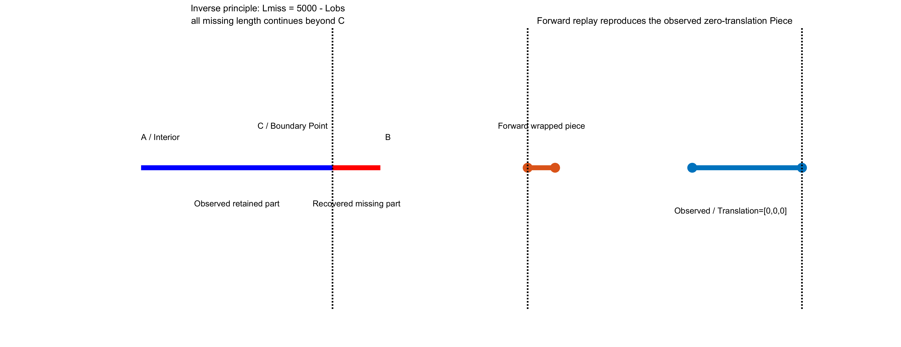
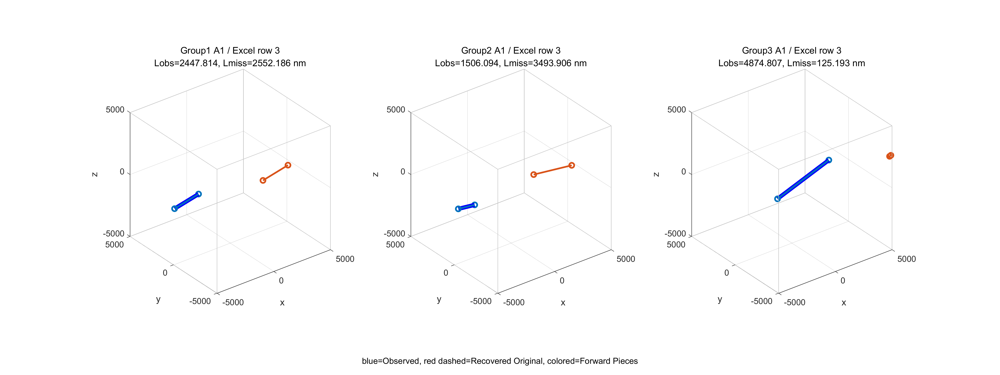
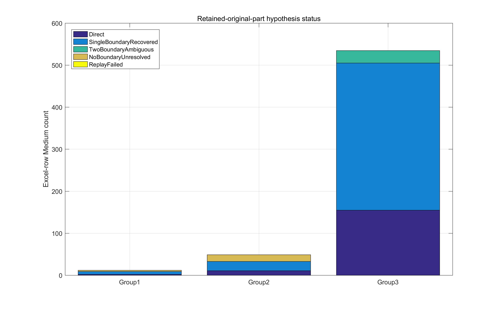
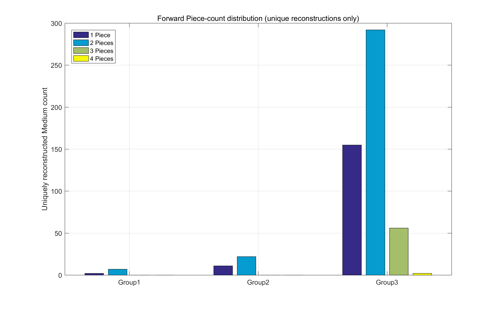
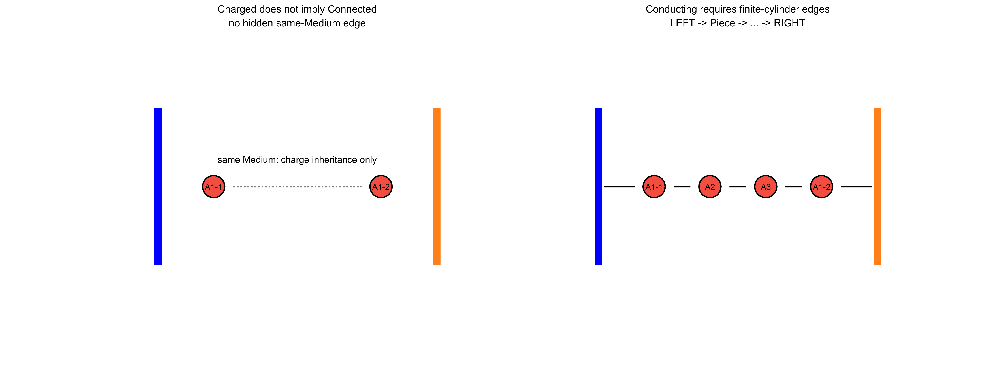
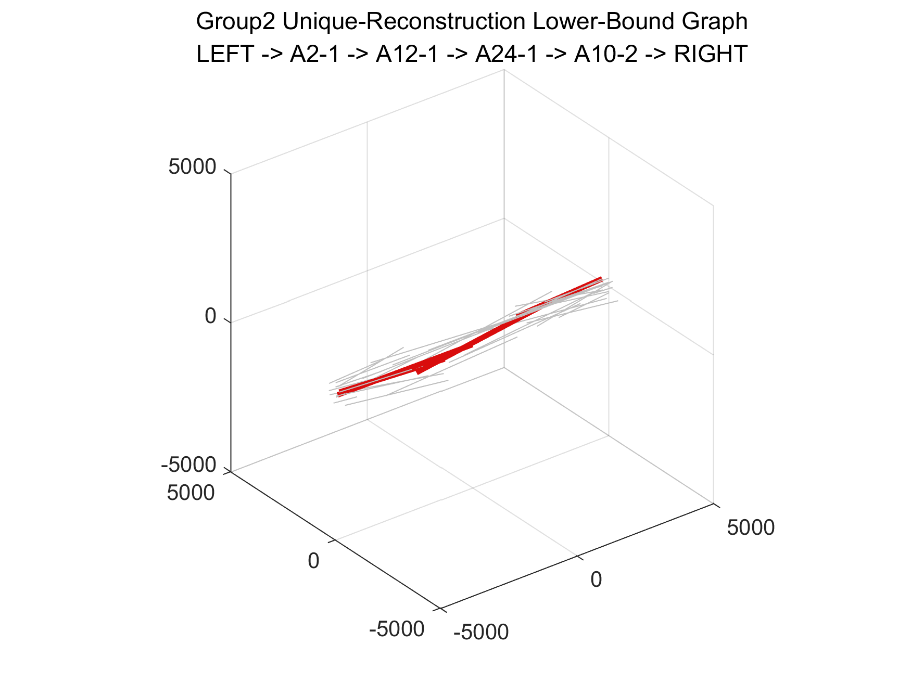
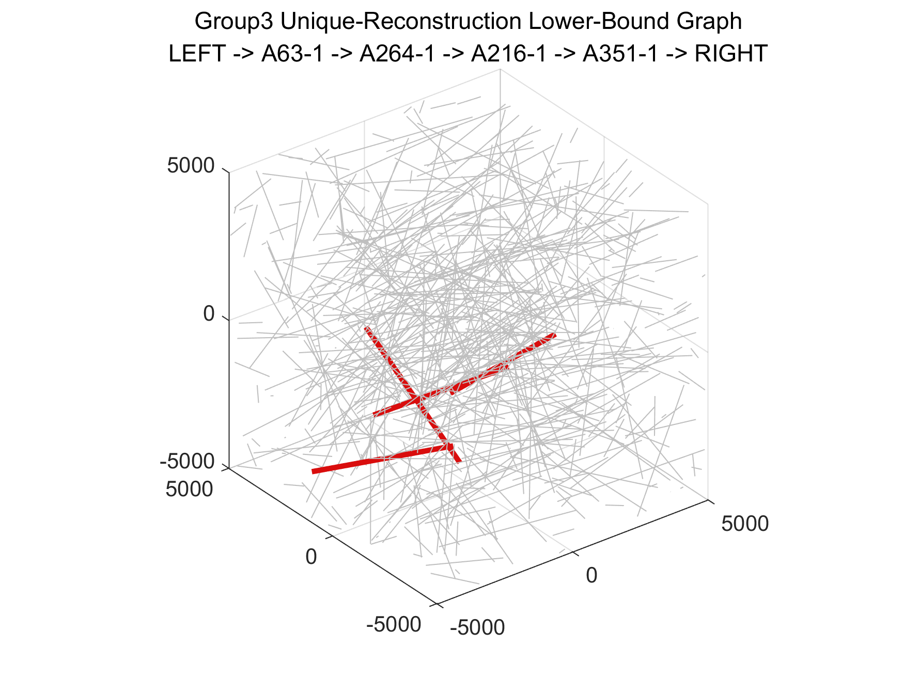

# 2026 华数杯 A 题：Q1 MATLAB 独立验证

本仓库使用 MATLAB 9.0 R2016a 验证边长 `10000 nm` 的周期微构体中，轴长 `5000 nm`、半径 `30 nm` 的有限平端圆柱介质 A 是否形成 LEFT（`x=-5000`）到 RIGHT（`x=5000`）的真实导电通路。介质或电极间表面距离不超过 `1.8 nm` 才建立物理导电边。

本分支为 `q1-retained-part-rebuild`，基于提交 `3924096dee6179646832da725ab74c71200b8039`，只验证一种可证伪假设，不跨 Excel 行，不改变附件坐标，不修改旧输出 `output/Q1/` 或 `output/Q1_endpoint_rebuild/`。

正式入口：

```matlab
setup_project
run('scripts/run_q1_retained_part.m')
```

全部新结果位于 `output/Q1_retained_part/`。完整运行必须处理 `596/596` 行，并打印：

```text
Q1 RETAINED-PART VALIDATION COMPLETE
```

## 前一轮 Endpoint 实验对照

前一独立分支 `q1-endpoint-unfold-final` 已完成 596 条记录的双端点周期像实验。相对位移 27 枚举与双端点 `27×27=729` 枚举对全部记录完全一致，但只能恢复 168 条原始距离已经为 5000 nm 的记录。

**简单双端点周期解卷已被 596×729 实验否证。** 本分支保留旧函数和旧输出用于版本对照，但 [`reconstructFromRetainedPart.m`](src/reconstructFromRetainedPart.m) 不调用 Endpoint `±10000` 枚举决定短记录结果。

# Q1 Retained Original Part Hypothesis

## 数学定义

附件每一行是一个独立 Medium，两个点是执行边界截断/平移后的观察结果；禁止把不同 Excel 行拼成同一 Medium。正式边界仅为：

```text
x,y,z = ±5000 nm
```

对观察点 `P1,P2`，记 `Lobs=norm(P2-P1)`。

- 若 `|Lobs-5000|<=1e-3 nm`，分类为 `DIRECT_FULL`，直接正向重放。
- 若 `Lobs<5000` 且恰有一个端点位于正式边界，定义非边界点为 `I`、边界点为 `C`，并统一定向

```text
u = (C-I)/Lobs
Lmiss = 5000-Lobs
OriginalStart = I
OriginalEnd   = C + Lmiss*u
```

全部缺失长度只允许出现在 `C` 之后；不允许 `a+b=Lmiss` 自由分配。若 `C` 位于 `x=+5000`，延伸方向必须满足 `u_x>0`；负面及 Y/Z 同理。角点只把方向实际向外穿越的面视为活动事件。

- 若短记录有两个正式边界端点，缺失长度可能分布在两侧，分类为 `AMBIGUOUS_TWO_BOUNDARY_RETAINED`，不选 midpoint，不扫描 `a/b`。
- 若短记录没有正式边界端点，分类为 `UNRESOLVED_NO_FORMAL_BOUNDARY`，不做自由补长、Endpoint 解卷或跨行配对。



PDF Figure 2 的含义在本模型中是：原地遗留部分为 `(3500,y1,z1)→(5000,y3,z3)`；越界部分为 `(5000,y3,z3)→(6000,y2,z2)`；后者平移为 `(-5000,y3,z3)→(-4000,y2,z2)`。逆向阶段只恢复完整直线，所有 X/Y/Z 后续事件统一交给 `wrapSegmentToBox` 计算。

## Forward Replay 硬验证

每个 Direct 或单边界候选必须满足：

```text
Recovered 5000 nm Medium
    -> wrapSegmentToBox
    -> 1/2/3/4 GeometryPieces
    -> Observed segment 在结果中真实重现
    -> 匹配 Piece 的 Translation=[0,0,0]
```

端点顺序可反转，匹配误差取两个方向中较小者。不能重现时状态为 `REJECTED_FORWARD_REPLAY`，不得放宽长度或容差。本轮实际 379 个单边界短记录全部完成零平移闭环，ReplayFailed 为 0。



## 596 条数据结构与恢复结果

程序从 `attachment.xlsx` 重新读取并统计，不硬编码分类数字。

| Group | Direct | SingleBoundary | Recovered | TwoBoundary | NoBoundaryShort | ReplayFailed |
|---|---:|---:|---:|---:|---:|---:|
| Group1 | 2 | 7 | 7 | 0 | 3 | 0 |
| Group2 | 11 | 22 | 22 | 0 | 16 | 0 |
| Group3 | 155 | 350 | 350 | 30 | 0 | 0 |
| 合计 | 168 | 379 | 379 | 30 | 19 | 0 |

最终状态为：

| Group | Unique | Ambiguous | Unresolved |
|---|---:|---:|---:|
| Group1 | 9 | 0 | 3 |
| Group2 | 33 | 0 | 16 |
| Group3 | 505 | 30 | 0 |
| 合计 | 547 | 30 | 19 |



单边界结果 `379/379` 支持“附件短段是原位置遗留部分”这一局部假设，但 30 条双边界记录仍不唯一、19 条无正式边界记录仍无法由本假设解释，因此不能宣称 596 条完整恢复。

## ±500 数据诊断

`±500` 不是正式边界，仅记录为 `HasAbs500Coordinate`：

- 596 条中共有 28 条含至少一个绝对值为 500 的坐标；
- 19 条 `RawLength<5000` 且无 `±5000` 正式边界端点的记录，全部含 `±500` 坐标；
- 这 19 条来自 Group1 的 3 条和 Group2 的 16 条。

该现象需要进一步核对附件生成机制或官方说明。本分支没有把 `±500` 当边界，没有乘 10、自动缩放或修改坐标。

## GeometryPiece 数量

只为 `DIRECT_FULL` 与 `RETAINED_SINGLE_BOUNDARY_UNIQUE` 构建 GeometryPieces。逆向重构器不写死 Piece 数量；正向包装器自动处理 X→Z、X→Y→Z 及同时多轴事件。

| Group | 1 Piece | 2 Pieces | 3 Pieces | 4 Pieces |
|---|---:|---:|---:|---:|
| Group1 | 2 | 7 | 0 | 0 |
| Group2 | 11 | 22 | 0 | 0 |
| Group3 | 155 | 292 | 56 | 2 |
| 合计 | 168 | 321 | 56 | 2 |

547 个唯一 Medium 共生成 986 个 GeometryPieces。



## Piece 物理图、带电与导通

物理规则沿用已验证核心：

- 同一 Medium 的不同 Piece 不自动建立导电边；
- Piece 可通过 `computeChargeState` 继承同一 Medium 的 Charged 状态，但 `Charged != Connected`；
- Piece-Piece 先以轴线距离 `61.8 nm` 广相排除，再由有限平端圆柱 GJK 计算真实实体距离；仅 `d_exact<=1.8 nm` 建边；
- 禁止用 `axisDistance-60` 作为正式判据；
- 不同 Medium 之间禁止 minimum image、27 mirrors 或全局周期镜像；
- 只有 X 的左右表面是电极，Y/Z 只参与周期边界且绝缘。



## Full Reconstruction Hard Gate 与严格下界

```text
Q1_MODEL_COMPLETE = false
```

未知 Medium 不能被丢弃后写成 Non-Conducting。模型不完整时，程序只用 547 个唯一恢复 Medium 建立 `UNIQUE_ONLY_LOWER_BOUND` 图：已有真实 LEFT→RIGHT 路径不会被后续补充 Medium 破坏；没有路径则仍只能写 `Q1_UNRESOLVED`。

| Group | Model Complete | Unique-only Conducting | Final Status |
|---|---|---|---|
| Group1 | false | false | `Q1_UNRESOLVED` |
| Group2 | false | true | `DEFINITELY_CONDUCTING_FROM_UNIQUE_SUBSET` |
| Group3 | false | true | `DEFINITELY_CONDUCTING_FROM_UNIQUE_SUBSET` |

下界图中的真实 BFS 路径：

```text
Group2: LEFT -> A2-1 -> A12-1 -> A24-1 -> A10-2 -> RIGHT
Group3: LEFT -> A63-1 -> A264-1 -> A216-1 -> A351-1 -> RIGHT
```





## 三组真实恢复案例

以下均为各组首个实际单边界成功记录，所有数值来自 MATLAB 输出。

### Group1 A1（Excel row 3）

```text
Observed:
[-5000,-123.595139885209,-413.210770780220]
-> [-2588.09423943591,263.800242732266,-256.916004757901]
Lobs=2447.81384794709, Lmiss=2552.18615205291

Recovered Original:
[-2588.09423943591,263.800242732266,-256.916004757901]
-> [-7514.74698018023,-527.508669386136,-576.169787379890]

Forward Pieces:
[-2588.09423943591,263.800242732266,-256.916004757901]
-> [-5000,-123.595139885209,-413.210770780220], T=[0,0,0]
[5000,-123.595139885209,-413.210770780220]
-> [2485.25301981977,-527.508669386136,-576.169787379890], T=[10000,0,0]
```

### Group2 A1（Excel row 3）

```text
Observed:
[-5000,-460.898289390296,-273.232450494890]
-> [-3512.12594512394,-404.979103320158,-500]
Lobs=1506.09418033954, Lmiss=3493.90581966046

Recovered Original:
[-3512.12594512394,-404.979103320158,-500]
-> [-8451.63794343944,-590.622162034890,252.833230701372]

Forward Pieces:
[-3512.12594512394,-404.979103320158,-500]
-> [-5000,-460.898289390296,-273.232450494890], T=[0,0,0]
[5000,-460.898289390296,-273.232450494890]
-> [1548.36205656056,-590.622162034890,252.833230701372], T=[10000,0,0]
```

### Group3 A1（Excel row 3）

```text
Observed:
[-5000,-4872.85737033347,2556.81333101074]
-> [-337.119122805609,-4694.65516508342,3967.32057366848]
Lobs=4874.80715336013, Lmiss=125.192846639874

Recovered Original:
[-337.119122805609,-4694.65516508342,3967.32057366848]
-> [-5119.75024081850,-4877.43388806041,2520.58924842467]

Forward Pieces:
[-337.119122805609,-4694.65516508342,3967.32057366848]
-> [-5000,-4872.85737033347,2556.81333101074], T=[0,0,0]
[5000,-4872.85737033347,2556.81333101074]
-> [4880.24975918150,-4877.43388806041,2520.58924842467], T=[10000,0,0]
```

## MATLAB R2016a 验证

新增 13 项 retained-part 测试全部通过，包括 Direct、PDF 单 X 案例、端点反转、正负 X、Y、Z、X→Z 三 Piece、X→Y→Z 四 Piece、同时 XY 无零长度 Piece、无正式边界、双边界歧义和 forward replay 拒绝。

以下原核心回归也全部通过：

- `testBoundaryPieceCounts`
- `testFourPieceMultiBoundary`
- `testSegmentSegmentDistance`
- `testGJKCylinderDistance`
- `testSameMediumDoesNotCreateConductEdge`
- `testThreePieceChargeInheritance`
- `testSplitMediumBridgePath`
- `testInsulatingFaceDoesNotDirectlyCharge`
- `testNoGlobalPeriodicFalseEdge`

新增工程的 MATLAB Code Analyzer 结果为 `TOTAL_ISSUES=0`。完整日志见：

- [`matlab_q1_retained_part.log`](output/Q1_retained_part/logs/matlab_q1_retained_part.log)
- [`q1_retained_test_results.txt`](output/Q1_retained_part/logs/q1_retained_test_results.txt)
- [`checkcode.log`](output/Q1_retained_part/logs/checkcode.log)

## 可复核输出

- [`q1_retained_summary.txt`](output/Q1_retained_part/q1_retained_summary.txt)：分支、版本、596 条统计、Piece 数量、三组真实案例及 BFS；
- [`retained_reconstruction_audit.csv`](output/Q1_retained_part/tables/retained_reconstruction_audit.csv)：每行边界、分类、恢复、正向重放与 `±500` 标志；
- [`reconstructed_pieces.csv`](output/Q1_retained_part/tables/reconstructed_pieces.csv)：唯一恢复 Medium 的全部 GeometryPieces；
- [`retained_classification_summary.csv`](output/Q1_retained_part/tables/retained_classification_summary.csv)：分类汇总；
- [`single_boundary_replay_summary.csv`](output/Q1_retained_part/tables/single_boundary_replay_summary.csv)：379 条单边界闭环统计；
- [`piece_count_audit.csv`](output/Q1_retained_part/tables/piece_count_audit.csv)：1/2/3/4 Piece 分布；
- [`physical_edges.csv`](output/Q1_retained_part/tables/physical_edges.csv)：有限圆柱真实物理边；
- [`charge_state_audit.csv`](output/Q1_retained_part/tables/charge_state_audit.csv)：Direct、几何传播与同 Medium 继承来源；
- [`q1_results.csv`](output/Q1_retained_part/tables/q1_results.csv)：Hard Gate、下界图与最终允许使用的状态。

本分支至此停止，不引入“附件可能是平移后的越界部分”第二假设，也不开始 Q2/Q3/Q4。
